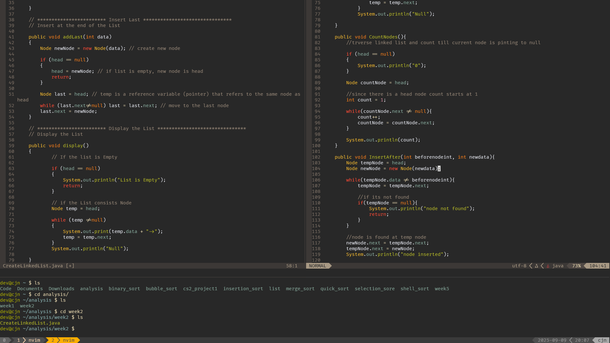

# Neovim Development Environment

A customized, fast, and relatively minimal development setup built on [Neovim](https://neovim.io/).
In the process of reducing the number of plugins needed to complete tasks without limiting features.

# Reasoning

One summer, I bought an older laptop for the goal of installing some Linux distribution and learn more about it. At the time, I was thinking this laptop would be some sort of hacking lab or something, and I had the idea to try to use the Command Line whenever I could. I tried nano, then emacs, but settled on Neovim due to its customizability and documentation availability. After months and months of researching and getting comfortable using it, I started to appreciate and have a better feel for Linux in general.

# Skills Gained

By building and using this environment for more than a year now, I've gained and improved skills in:

* Linux Proficiency: daily terminal workflow, Package management, file permissions, system navigation
* Shell Proficiency: Bash usage, shell scripting, tmux multiplexer
* Programming aid: Language Server Protocols with languages such as C++, Python, Java, Bash, and Lua 
* Configuration Management: environment variables, modular Lua configuration, plugin management with Packer, and maintaining dotfiles to my liking
* Version Control: Git integration directly inside Neovim with Lazygit for easy remote syncing

# Example of Environment

